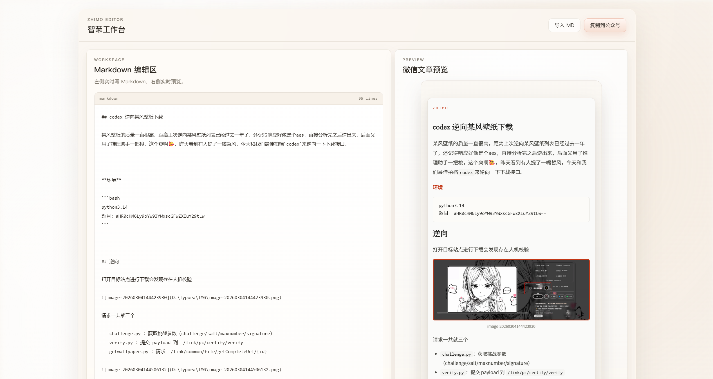

# ZHIMOwriter



一个面向微信公众号排版场景的 Markdown 编辑与预览工具。

## 当前能力

- 左侧直接编写 Markdown，右侧实时预览公众号排版效果
- 支持导入 `.md` 文件
- 支持本地绝对路径图片与图床图片渲染
- 支持复制带格式内容到公众号编辑器
- 支持代码块高亮
- 保留公众号文章风格化排版细节

## 本地启动

```bash
npm install
npm run dev
```

## 构建

```bash
npm run build
```

## 技术栈

- React 19
- TypeScript
- Vite
- markdown-it
- highlight.js
